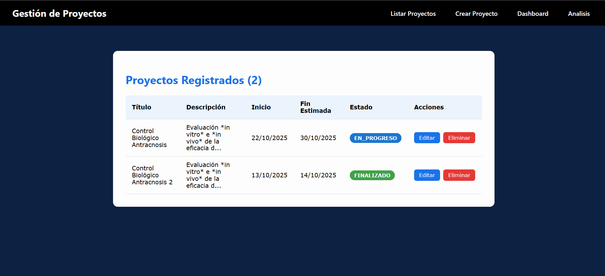

# 📌 Proyecto Fullstack – GLocation

## Autor
**Nombre:** Jorge Pinilla  
**Fecha de entrega:** 20/10/2025  

---

## 🏁 Objetivo
Desarrollar un sistema fullstack que permita:

- Crear, listar, actualizar y eliminar proyectos mediante una API REST en Node.js.  
- Persistir datos en PostgreSQL usando un ORM (Prisma).  
- Documentar la API con Swagger.  
- Integrar una funcionalidad de IA generativa para resumir descripciones de proyectos.  
- Presentar los datos en una interfaz web responsiva con tablas y gráficos.  
- Aplicar arquitectura limpia en el backend y estructura modular Core/Shared/Feature en el frontend.  

---

## 🛠️ Tecnologías utilizadas

### Backend
- Node.js 20 + Express
- PostgreSQL
- ORM: Prisma
- Swagger para documentación
- Axios (para llamadas a la API de IA generativa)
- Arquitectura limpia de 3 capas: Domain, Presentation, Infrastructure
- Dotenv para variables de entorno

### Frontend
- Angular 16 (Standalone Components)
- Arquitectura Core / Shared / Feature
- Bootstrap 5 para diseño responsivo
- Chart.js para gráficos interactivos

### Contenerización (Opcional)
- Docker
- Docker Compose

---

## ⚙️ Instalación y ejecución

### Backend
```bash
cd backend
npm install
cp .env.example .env
# Configura las variables de entorno: DATABASE_URL, PORT, API_KEY_IA
npx prisma migrate dev
npx prisma db seed
npm run dev
```

### Frontend
```bash
cd frontend
npm install
ng serve
# Abrir en: http://localhost:4200
```

### Docker (opcional)
```bash
docker-compose up --build
```

---

## 🔹 Estructura del proyecto

### Backend (Arquitectura limpia 3 capas)
```
/backend
  ├─ src
  │   ├─ presentation   # Controllers y rutas
  │   ├─ domain         # Interfaces, entidades y lógica de negocio (AISummaryService)
  │   ├─ infrastructure # Implementaciones concretas de repositorios, Prisma y servicios externos (GoogleAISummaryService)
  │   ├─ routes
  │   └─ app.js
```

### Frontend (Modular)
```
/frontend
  ├─ src
  │   ├─ app
  │   │   ├─ core       # Servicios globales, interceptors
  │   │   ├─ shared     # Componentes reutilizables, pipes
  │   │   ├─ features   # Funcionalidades (Proyectos, Gráficos, IA)
  │   │   └─ app.module.ts
  │   └─ main.ts
```

---

## 📄 Endpoints principales

- Se implementaron **7 endpoints**:

| Método | Ruta | Descripción |
|--------|------|-------------|
| GET    | /proyectos | Listar todos los proyectos |
| POST   | /proyectos | Crear un proyecto |
| GET    | /proyectos/:id | Obtener proyecto por ID |
| PUT    | /proyectos/:id | Actualizar proyecto |
| DELETE | /proyectos/:id | Eliminar proyecto |
| POST   | /analisis | Generar resumen de descripción usando IA |
| GET    | /graficos | Datos agregados (proyectos por estado) |

- Documentación de todos los endpoints con **Swagger**: `http://localhost:3000/api-docs`

---

## 💡 Decisiones técnicas

- **Arquitectura limpia backend (3 capas)**:  
  - **Presentation**: Controllers y rutas, reciben las solicitudes HTTP y devuelven las respuestas.  
  - **Domain**: Lógica de negocio pura, interfaces y servicios como `AISummaryService`.  
  - **Infrastructure**: Implementaciones concretas de acceso a datos y servicios externos, como `GoogleAISummaryService`, Prisma y manejo de logs.  

- **IA generativa**:  
  Se implementó un servicio `GoogleAISummaryService` que utiliza la API de Google Generative AI (modelo `gemini-2.5-flash`) para generar un **resumen profesional y conciso de las descripciones de los proyectos**.  
  - Recibe un arreglo de descripciones de proyectos.  
  - Las concatena con separadores y genera un prompt para la IA.  
  - Devuelve un texto resumido que se muestra en el frontend.  
  - Manejo de errores robusto con logging y mensajes claros para el usuario.  

- **Prisma**: ORM para manejo eficiente de PostgreSQL y migraciones automáticas.  
- **Swagger**: Documentación automática de los 7 endpoints de la API.  
- **Angular Core/Shared/Feature**: Frontend modular, responsivo y mantenible.  
- **Chart.js**: Visualización clara de datos en gráficos de barras o torta.  

---

## 🔍 Ejemplos de uso de la API

**Crear proyecto**
```http
POST /proyectos
Content-Type: application/json

{
  "nombre": "Proyecto Alpha",
  "descripcion": "Descripción del proyecto Alpha",
  "estado": "En progreso",
  "fechaInicio": "2025-10-18",
  "fechaFin": "2025-11-18"
}
```

**Respuesta**
```json
{
  "id": 1,
  "nombre": "Proyecto Alpha",
  "descripcion": "Descripción del proyecto Alpha",
  "estado": "En progreso",
  "fechaInicio": "2025-10-18",
  "fechaFin": "2025-11-18"
}
```

---

## 🖥️ Interfaz web responsiva

  
  
  
  
  
  

